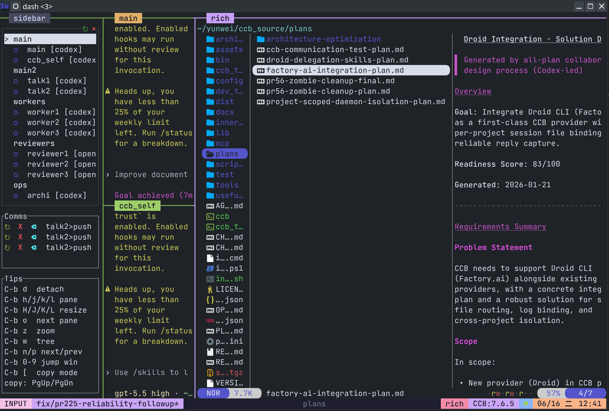

<div align="center">

# CCB - O app móvel chegou!

**Um TUI multiagente leve com uma camada estável de colaboração entre providers**<br>
**Coordene Codex, Claude, Gemini e outros agentes CLI em fluxos visíveis e controláveis que você pode assumir diretamente**

<p>
  
  
  
</p>

<p>
  
  
  
  
  
  
  
  
  
  
  
  
  
  
  
  
</p>

[中文](zh.md) | [English](../README.md) | [日本語](ja.md) | [Français](fr.md) | [Deutsch](de.md) | [العربية](ar.md) | [Español](es.md) | **Português** | [한국어](ko.md) | [Русский](ru.md)

[Início rápido](#quick-start) · [Mobile App](#mobile-app) · [Modo Rich](#rich-mode) · [Configurar agentes](#configure-agents) · [Guia do usuário](../docs/manuals/user-guide/) · [Guia do desenvolvedor](../docs/manuals/developer-guide/)

<p align="center">
  
</p>

</div>

<a id="why-ccb"></a>

## Por que CCB?

- Comunicação estável entre agentes para grafos complexos como `A -> B -> C`, `A,B -> C` e `A -> B,C`.
- Cada agente é um terminal nativo completo, com controle visível de layout e intervenção direta.
- O daemon em segundo plano mantém o estado do projeto mesmo quando a UI de primeiro plano é fechada.
- Capacidade Hub: execute vários CLI providers em paralelo a partir de um único comando.
- Controle remoto móvel: controle por voz entre providers, transferência de arquivos e acesso a terminal remoto.

<a id="how-to-install"></a>

## Como instalar

Instale ou atualize com npm:

```bash
npm install -g @seemseam/ccb
```

Depois de instalar o CCB, use o updater integrado:

```bash
ccb update
```

<details>
<summary><b>Pacote GitHub release e instalação por fonte como fallback</b></summary>

Se npm não for conveniente no seu ambiente, baixe o pacote adequado em [Releases](https://github.com/SeemSeam/claude_codex_bridge/releases), descompacte e instale:

```bash
tar -xzf ccb-*.tar.gz
cd ccb-*
./install.sh install
```

A instalação por fonte é indicada apenas para desenvolvimento ou fallback temporário:

```bash
git clone https://github.com/SeemSeam/claude_codex_bridge.git
cd claude_codex_bridge
./install.sh install
```

A instalação por fonte aponta os comandos globais `ccb` / `ask` de volta para o checkout. Usuários comuns devem preferir o pacote npm.

</details>

<a id="quick-start"></a>

## Início rápido

### 1. Iniciar

Execute a partir do seu diretório de trabalho:

```bash
ccb
```

Se a inicialização informar que `.ccb` não pode ser criado automaticamente ou que a âncora do projeto está ausente, crie `.ccb` manualmente:

```bash
mkdir -p .ccb
```

<a id="configure-agents"></a>

### 2. Criar configuração do projeto

Um projeto vazio inicia de forma leve: o CCB abre apenas uma window `main` com um agent chamado `demo` e seleciona o primeiro CLI compatível disponível na máquina. Uma equipe multiagente não é mais montada por padrão.

Clique em **⚙ Configurações** no canto superior esquerdo da sidebar do CCB para abrir o painel de configuração local. Você também pode executar `ccb config ui`.

<p align="center">
  
</p>

O painel configura windows, divisões de panes, providers, modelos, níveis de thinking, API overrides, workspaces, modo Rich e sidebar. Ele valida antes de salvar e oferece reload dry-run e hot reload protegido.

Para uma topologia multiagente avançada, adicione agents visualmente ou crie `.ccb/ccb.config` manualmente. `,` e `;` controlam empilhamento vertical e divisões horizontais; `A,B;C,D` se aproxima de quatro panes.

```toml
version = 2

[windows]
main = "main:codex"
work = "worker1:codex(worktree), worker2:claude(worktree)"
review = "reviewer:claude, qa:gemini"

[ui.sidebar]
mode = "every_window"
width = "15%"
bottom_height = 20
agents_height = "50%"
comms_height = "15%"
tips_height = "35%"
comms_limit = 3
```

Valide a configuração e inicie o workspace:

```bash
ccb config validate
ccb
```

### 3. Colaborar

Você pode digitar diretamente em qualquer agent pane ou deixar os agentes colaborarem:

```text
/ask reviewer review the latest parser changes and list blocking issues.
```

Agentes também podem chamar `/ask` durante a orquestração de workflows para delegar e passar trabalho adiante. Use a memória de agent ou o arquivo compartilhado do projeto `.ccb/ccb_memory.md` para coordenação durável.

<a id="mobile-app"></a>

## Controle remoto móvel (Android)

A forma recomendada de controlar o CCB pelo telefone pode conectar-se a todos os projetos CCB, controlar cada agent, aceitar entrada por voz e transferir arquivos.

```bash
ccb update mobile
```

Esse comando orienta a instalação e a configuração.

<p align="center">
  
  
  
  
</p>

<details>
<summary><b>Detalhes do Mobile App, limite de segurança e fonte</b></summary>

O CCB 8.1.3 inclui o código Flutter do CCB Mobile em [`mobile/`](../mobile/) e publica o APK Android pelo GitHub Releases:

- [Baixar CCB Mobile v8.1.3 APK](https://github.com/SeemSeam/claude_codex_bridge/releases/download/v8.1.3/ccb-mobile-v8.1.3.apk)
- Fonte do app: [`mobile/app`](../mobile/app)
- Fonte do gateway servidor: [`lib/mobile_gateway`](../lib/mobile_gateway)

O app do telefone é um controlador remoto para projetos CCB reais rodando em um servidor. Ele pode descobrir projetos montados pelo mobile gateway server-wide, trocar windows e agents, renderizar contexto de conversa, enviar texto via entrada pane-native, abrir uma visão terminal e enviar/baixar imagens e documentos pelo gateway autenticado.

Limite de segurança:

- O gateway CCB faz bind apenas em loopback, por exemplo `127.0.0.1:8787`.
- O acesso remoto usa Tailscale Serve, não Tailscale Funnel.
- O CCB não armazena senhas Tailscale, OAuth tokens, admin API tokens, nem modifica ACLs/grants do tailnet automaticamente.
- O telefone recebe apenas os scopes autorizados pelo pairing profile, como view, content, terminal, file upload e file download.

</details>

<a id="rich-mode"></a>

## Terminal multimídia Rich

Explore árvores de arquivos, abra arquivos, edite documentos e visualize mídia dentro do terminal.

<p align="center">
  
</p>

```bash
ccb update rich
```

Depois que rich mode é ativado, `ccb` normal abre automaticamente o rich WezTerm launcher, a menos que já esteja rodando dentro de uma sessão rich WezTerm gerenciada pelo CCB. Execute `ccb uninstall rich` para voltar ao início normal no terminal.

<a id="agent-roles"></a>

## Agent Roles Spec e catálogo de roles

O CCB suporta [Agent Roles Spec](https://github.com/SeemSeam/agent-roles-spec), uma especificação host-neutral para empacotar agentes especialistas. Ela pode agrupar skills, memória e dependências de ferramentas em Role Packs instaláveis, montáveis e removíveis. Esse repositório também serve como catálogo público de roles.

| Role | Propósito |
| :--- | :--- |
| `agentroles.ccb_self` | Automanutenção do CCB, ajuda de configuração, diagnóstico runtime, recuperação protegida e orquestração de workflow. |
| `agentroles.archi` | Revisão de arquitetura, checagem de limites, análise de acoplamento, riscos de manutenção e recomendações de gates. |
| `agentroles.frontend_engineer` | Design e implementação frontend, design systems, acessibilidade, QA de navegador e delegação AGY revisada. |
| `agentroles.mobile_app_engineer` | Design e implementação mobile para iOS, Android, React Native, Expo, Flutter, SwiftUI, Jetpack Compose e mais. |
| `agentroles.mother` | Criação de roles, auditoria de role source, pesquisa de roles, design de blueprint e checagens de conformidade Agent Roles. |
| `agentroles.su_ccb` | Operações workflow SU-CCB para análise de requisitos, planejamento, dispatch, review gates, arquivamento e recuperação. |

<a id="config-memory"></a>

## Configuração e memória compartilhada

Para a configuração normal do projeto, use o painel **⚙ Configurações**. Para configuração assistida por agent e diagnóstico runtime, `ccb_self` continua disponível como Role Pack opcional e pode ser adicionado com `ccb roles add agentroles.ccb_self:codex`.

`.ccb/ccb_memory.md` é o documento de memória compartilhada de todo o projeto. Use-o para regras de colaboração da equipe, restrições do projeto, contexto durável e convenções de handoff entre agents. Informações estáveis entre agents devem ficar ali, em vez de serem copiadas para várias memórias privadas de providers.

<a id="contact"></a>

## Contato

- Email: `bfly123@126.com`
- [Telegram group & contact / TG 群与联系](https://t.me/+BKn03v8I_ehmYzRk)
- WeChat: `seemseam-com`

<p align="center">
  
</p>

<a id="community"></a>

## Comunidade e créditos

Obrigado à [comunidade Linux.do](https://linux.do) pelos testes, feedback e discussão.

Obrigado ao [tmux-agent-sidebar](https://github.com/hiroppy/tmux-agent-sidebar) pelas ideias e inspiração de sidebar.

<a id="release-notes"></a>

## Notas de versão

<details open>
<summary><b>v8.0.14</b> - Organização do diretório README e superfície mobile</summary>

- O `README.md` raiz voltou a ser a página GitHub em inglês.
- READMEs localizados agora ficam em [`README/`](./), com chinês em [`zh.md`](zh.md).
- Links do Mobile App, package metadata e release notes apontam para o APK 8.0.14.

</details>

<details>
<summary><b>v8.0.12</b> - Portabilidade do Release CI e localização do README</summary>

- Testes mobile host registry agora colocam Unix sockets temporários em um caminho curto `/tmp/ccb-sock-*`, evitando falhas `AF_UNIX path too long` no macOS CI.
- `ccb update mobile`, links do README, package metadata e o mobile release manifest agora apontam para o APK 8.0.12.
- O v8.0.12 introduziu READMEs multilíngues com a mesma estrutura de seções; os arquivos localizados atuais ficam no diretório `README/`.

</details>

<details>
<summary><b>v8.0.0</b> - Lançamento do CCB Mobile Monorepo</summary>

- O código Flutter do CCB Mobile entrou oficialmente neste repositório, com o APK Android publicado via GitHub Releases.
- Foram adicionados descoberta server-wide de projetos mobile, pairing, rotas gateway autenticadas, entrada pane-native, renderização de contexto de conversa, acesso terminal e upload/download de imagens e documentos.
- `ccb update mobile` virou o ponto de entrada unificado de onboarding Tailscale Tailnet, mantendo o gateway loopback-only, sem Funnel, sem armazenar tokens e sem modificar ACLs/grants automaticamente.

</details>

<details>
<summary><b>v7.7.0</b> - Endurecimento de release do Runtime Accelerator</summary>

- Os release artifacts agora incluem o Rust `ccb-runtime-accelerator` opcional; agents Codex instalados não retornam silenciosamente ao Python hot path quando o sidecar é esperado.
- Quando o caminho do projeto torna o Unix socket path longo demais, o accelerator socket migra automaticamente para uma raiz runtime curta por usuário.
- Callback repair e invalidação do cache de binding Codex foram reforçados, com evidências de regressão, long-idle Codex soak, callback Claude e integração mixed-provider.

</details>

<details>
<summary><b>v7.6.19</b> - Política padrão de espera para ask longo</summary>

- Chamadas `ask` longas agora continuam aguardando resultados reais de provider/completion, em vez de terminar como `incomplete/heartbeat_timeout` apenas por diagnósticos heartbeat.
- No-terminal timeouts pane-backed de Codex, Claude e Gemini agora são opt-in explícito por padrão, mantendo disponíveis políticas explícitas de reliability timeout.
- Um smoke source-runtime ask de 32 minutos confirmou que uma tarefa pode permanecer running por mais de 30 minutos e depois concluir com `result_message`, sem evidência de `heartbeat_timeout` ou `incomplete`.

</details>

Veja o histórico completo em [CHANGELOG.md](../CHANGELOG.md).
