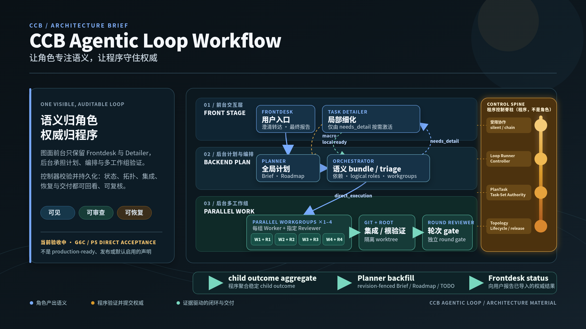

# CCB Agentic Loop Workflow 架构说明

> 当前验收中：本文以 2026-07-12 对 `workflow/g6c-integration` 的只读核对为事实基线。Decision 029 的 P0–P4 已集成，P5 直接验收仍在进行；它不是 production-ready、已发布或默认启用的声明。请以 [implementation status](plantree/plans/agentic-loop-workflow/implementation-status.md) 和当前集成分支代码为准。



本页配套可维护源图：

- [总览 Mermaid 源图](assets/agentic-loop-workflow/agentic-loop-workflow-overview.mmd)
- [闭环与恢复 Mermaid 源图](assets/agentic-loop-workflow/agentic-loop-workflow-feedback-loop.mmd)
- [可编辑 SVG 宣传图](assets/agentic-loop-workflow/agentic-loop-workflow-promo.zh.svg)
- [PNG 宣传图](assets/agentic-loop-workflow/agentic-loop-workflow-promo.zh.png)

## 1. 阅读边界与事实清单

CCB 的关键分工是：**角色产出语义，程序验证并提交权威**。角色的回复是提案或证据；任务状态、task-set、revision、job、拓扑、Git 集成、释放及用户可见交付由脚本和持久化记录裁决。

| 已核对事实 | 依据 | 本文的表达边界 |
| --- | --- | --- |
| 当前目标是一个可见的 Frontdesk 发起 lane，含一个语义 orchestration bundle 和 1–4 个 `Worker + Reviewer` workgroup。 | [实施状态](plantree/plans/agentic-loop-workflow/implementation-status.md)、[路线图](plantree/plans/agentic-loop-workflow/roadmap.md) | 不把多 lane 并发执行描绘为已交付能力。 |
| 正常主线先由 Orchestrator triage：`direct_execution`、`needs_detail`、`macro_adjustment_request` 或 `blocked`。Detailer 只由 `needs_detail` 按需激活。 | [当前实施状态](plantree/plans/agentic-loop-workflow/implementation-status.md)；集成实现：`lib/cli/services/plan_tasks.py`、`loop_runner.py` | 不画出 Planner 正常直达 Controller，或 Frontdesk 正常直达 Detailer 的主链。 |
| Frontdesk 向 Planner 的自动语义交接是 Frontdesk 自己发起的受限 `ask --silence`；Controller 不能改写其正文。 | [当前实施状态与 Decision 028 锚点](plantree/plans/agentic-loop-workflow/implementation-status.md)；集成实现：`lib/ccbd/services/dispatcher_runtime/frontdesk_direct_handoff.py` | Frontdesk 只做入口、澄清转达、最终报告和不可恢复升级。 |
| Orchestrator 一次产出完整语义 bundle；Controller 只验证、绑定、mount、提交、恢复与导入，不能重切任务或改写 packet。 | [当前实施状态与 Decision 022 锚点](plantree/plans/agentic-loop-workflow/implementation-status.md) | “控制脊柱”必须画成程序面，绝不伪装成 Agent role。 |
| 每个 node 的 Worker 自己以受限 `ask --chain` 协同指定 Reviewer，并支持有界返工；Controller 只提交一次 root Worker job。 | [当前实施状态与 Decision 027 锚点](plantree/plans/agentic-loop-workflow/implementation-status.md) | 不画出 Controller 代写 reviewer/rework 消息的旧式 relay。 |
| Detailer 的结果精确区分 `local_detail_ready`、`planner_replan_required`、`needs_clarification`、`blocked`；macro replan 是唯一受限的 Detailer→Planner silent handoff。 | [当前实施状态与 Decision 029 锚点](plantree/plans/agentic-loop-workflow/implementation-status.md)；集成实现：`lib/ccbd/services/dispatcher_runtime/detailer_replan_handoff.py` | 局部细化不能改写 Planner 的宏观权威。 |
| task-set 的最终 child 转换由程序聚合；其 closure、Planner backfill 与 Frontdesk status 都受 revision/digest/exact-once 约束。 | [当前实施状态与 Decision 029 锚点](plantree/plans/agentic-loop-workflow/implementation-status.md)；集成实现：`lib/cli/services/task_set_closure.py`、`task_set_feedback_runtime.py` | 分解完成不是宏观任务完成；不能把 mixed outcome 降格为 pass。 |
| mount topology、动态 pane、release 和 residue evidence 是程序的物理生命周期责任；Topology Controller 是项目级的确定性 authority。 | [当前实施状态与 Decision 024 锚点](plantree/plans/agentic-loop-workflow/implementation-status.md)；集成实现：`lib/cli/services/loop_ask_first.py` | 语义 bundle 与物理绑定分开；容量变化必须显式冲突，不可静默改图。 |

当前分支的直接验收仍需要完成最新 HEAD 的完整 gate、fresh opened-project 路由、三/四 workgroup、restart、busy-retain、provider qualification 与打包门禁。此前 Root8 的部分路线是诊断证据而不是 pass；完整边界见 [实施状态](plantree/plans/agentic-loop-workflow/implementation-status.md#current-phase)。

## 2. 三层职责

| 层 | 参与者 | 负责的语义或结果 | 明确不拥有 |
| --- | --- | --- | --- |
| 前台交互层（图面仅保留这两个角色） | **Frontdesk** | 用户入口分类、把澄清在用户边界间转达、最终报告、不可恢复时升级。 | 计划切分、实施、轮次判定、直接改写任务/运行时状态。 |
| 前台交互层（图面仅保留这两个角色） | **Task Detailer** | **仅在 Orchestrator 给出 `needs_detail` 时**按需取得局部源码事实，生成 detail packet 与 global-impact 分类。`local_detail_ready` 回 Orchestrator；macro 以受限 silent ask 交给 Planner；澄清回用户交互边界。 | Roadmap/Brief/TODO 写权、启动 Worker、任意 target 或 generic CCB 命令。 |
| 后台计划与编排层 | **Planner** | 维护 Brief、Roadmap、TODO、全局不变量、task-set、宏观验收和 revision-fenced backfill。 | 从 provider prose 直接定案，或让分解本身被视为完成。 |
| 后台计划与编排层 | **Orchestrator** | 在一个 activation 中生成语义 bundle：work-unit、依赖、逻辑 role、packet、验收、review/integration point、bounded rework、capacity intent。 | 物理 agent 绑定、状态写入、mount、job exact-once、把容量不足悄悄改成串行。 |
| 后台多工作组与验证层 | **1–4 个 Worker + Reviewer workgroup** | 每个 DAG-ready node 由一组 Worker + 指定 Reviewer 执行；多个独立 workgroup 可并行打开。Worker 只向指定 Reviewer 发受限 chain；有界返工后返回终态。 | 脱离指派 Reviewer 的 chain、写 CCB authority、把非 pass 解释为 pass。 |
| 后台多工作组与验证层 | **Git Integration / Root Verification / Round Reviewer** | 隔离 worktree 的确定性集成、根验证、轮次 gate 和 round evidence。 | 将未验证或范围漂移的 tree 提升为权威完成。 |

图中的“前台 / 后台”是**信息分层**：前台只画 Frontdesk 与按需 Detailer，避免把后台控制与执行角色误读成用户入口；它不改变运行时的 pane 可见性、常驻/动态生命周期或 role authority。

## 3. 程序控制脊柱：贯穿，而非一个角色

控制脊柱在三层之间保留可恢复的机械事实；它不判断“方案是否好”，也不重新解释自然语言。

| 程序环节 | 受控协议 / 记录 | 它保证什么 | 它不得做什么 |
| --- | --- | --- | --- |
| 受限协作入口 | Frontdesk `ask --silence`、Detailer replan envelope、Worker restricted chain | 单 target、正确 role、task id、inline/evidence shape、可追踪 job。 | 改写 Frontdesk 或 Detailer 的语义正文。 |
| `Loop Runner` / deterministic Controller | task route、callback、durable intent、job lineage、resume | 只在 authority 允许时推进；unknown submission 停住而非重发或判成功。 | 重新切分工作、改写 bundle、从回复 prose 推断成功。 |
| `PlanTask + Task-Set Authority` | task/task-set revision、ordered terminal evidence digest、closure intent、expected PlanTree revision | exact-once、stale fence、混合结果的固定 precedence、Planner backfill 的条件。 | decomposition 后直接关闭父请求，或逐 child 重复 Planner ask。 |
| Topology Controller | capacity snapshot、锁、desired/observed topology、绑定、pane/lifecycle records | 角色到具体 agent 的绑定、可见性、隔离、busy-retain、release/residue evidence。 | 选择 Roadmap 优先级、改写 workgraph、判断质量。 |
| 执行与集成 | node worktree digest、controller commit、Git DAG、root verification、round import | exact final tree、允许范围、root gate、可靠回滚/释放。 | 接受 post-review mutation、遗漏 chain lineage 或 scope drift。 |

程序主干的集成实现入口是 `lib/cli/services/loop_runner.py`、`plan_tasks.py`、`task_set_closure.py`、`planner_feedback_apply.py` 与 `loop_ask_first.py`。旧的 `topology_dispatch.py` 是显式 opt-in 的 legacy compatibility surface，不是 mainline runner authority。

## 4. 主流程：从用户到闭环

总览图源见 [agentic-loop-workflow-overview.mmd](assets/agentic-loop-workflow/agentic-loop-workflow-overview.mmd)。它表达的必经闭环如下：

```text
User -> Frontdesk -- silent --> Planner
  -> task-set / child task
  -> Orchestrator triage
     -> direct_execution -> Controller
     -> needs_detail -> Task Detailer -> local_detail_ready -> Orchestrator
     -> macro_adjustment_request -> Planner
     -> blocked -> Controller-visible evidence / Frontdesk escalation
  [dispatchable direct_execution or accepted local detail]
  -> Controller -> Worker <-> Reviewer
  -> Git integration
  -> root verification
  -> Round Reviewer
  -> child outcome aggregate
  -> Planner backfill
  -> Frontdesk status
  -> User
```

1. **用户到 Planner。** Frontdesk 对项目工作形成完整 Intake/Blocked Evidence，以固定形状的 silent ask 交给 resident Planner 并停止。相同 request id 与相同正文复用已持久化 job；冲突复用显式失败。
2. **Planner 到可执行任务。** Planner 选择单 task 或 task-set。task-set 的 source intake 可以是 `decomposed`，但尚不是完成；子任务与 required/optional membership、revision 和父 authority 被固定下来。
3. **Orchestrator triage 先行。** Planner 的 macro task 先进入 Orchestrator。它只可给出 `direct_execution`、`needs_detail`、`macro_adjustment_request` 或 `blocked` 等明确路线；这一步决定是否派发，不能由 Planner 或 Frontdesk 绕过。
4. **仅 `needs_detail` 进入 Detailer。** Orchestrator 以 refinement request 加 Planner refs 激活 Detailer。`local_detail_ready` 把局部 packet 交回 Orchestrator；macro impact 走受限 silent ask 回 Planner；`needs_clarification` 通过 Frontdesk 所守的用户交互边界转达；`blocked` 保留为可验证证据。
5. **可派发路线的物理执行。** `direct_execution` 或接受局部 detail 后的 Orchestrator 输出，才交由 Controller 校验 schema、revision、capacity 与 digests，提交 topology intent、等待 observed readiness，然后对每个 DAG-ready node 仅提交一次 root Worker ask。独立 node 可并行，当前目标容量是 1–4 个 workgroup。
6. **独立审查和根 gate。** Worker 通过受限 chain 同指定 Reviewer 协作；终态 tree 必须与脚本绑定 digest 一致。之后程序进行 Git integration、root verification 与 Round Reviewer gate，才导入 child authority。
7. **宏观闭环。** 最后 required child 到稳定终态后，程序聚合 child outcomes，创建一个 closure intent，并向 Planner 发一次 backfill。Planner 的 revision-fenced proposal 被验证和导入后，才生成 Frontdesk status；Frontdesk 只报告已导入的摘要。

Decision 022 允许一种**例外**：Planner packet 必须显式满足预定义的单 Worker/单 Reviewer 模板，且通过确定性资格校验，才可能跳过 Orchestrator provider activation。该决策同时禁止在缺少 source 和 real opened-project evidence 时把优化路径写成已实现能力。当前 P5 直接验收仍在进行，因此图中刻意不画 `Planner -> Controller` 的常规或可用 fast path；当前主线仍是 Decision 019 的 Orchestrator triage。

## 5. 三类分支

完整时序图源见 [agentic-loop-workflow-feedback-loop.mmd](assets/agentic-loop-workflow/agentic-loop-workflow-feedback-loop.mmd)。

### 5.1 Macro replan

Orchestrator 可在 triage 中以 `macro_adjustment_request` 把宏观问题交回 Planner；Detailer 也可在 `needs_detail` 后发现宏观 scope、公开接口、依赖、排序、验收、风险或 Planner-owned surface 改变，并输出 `planner_replan_required`。Detailer 只能以 `ccb.detailer.replan_request.v1` 向 resident Planner 发一份受限 silent ask。Controller 验证身份、task revision 与 digests，令旧 bundle 失效，阻止 Worker dispatch；Planner 接受修订后，才启动新鲜 Orchestrator 重新 triage。

### 5.2 Blocked 与 partial

task-set closure 的优先级是脚本规则，不是角色的修辞：

| required child 的稳定结果 | aggregate | 下一位 owner |
| --- | --- | --- |
| 全部 `pass` | `pass` | Planner completion backfill |
| 任一 `replan_required` | `replan_required` | Planner 从**一份聚合**输入重规划 |
| 有 `partial`、无 replan | `partial` | Planner 保留已接受工作并规划余量 |
| `pass` 加 required `blocked` | `partial` | Planner 记录已落地范围和未解分支 |
| 所有未完成 required child 都 `blocked` | `blocked` | Planner/Frontdesk escalation |
| cleanup、authority、revision 或 evidence 失败 | 无语义结果 | Controller-visible system failure |

任何 child 仍运行、等待澄清、缺少 cleanup/release authority，或引用较新 task-set revision 时，aggregator 都不得 closure。

### 5.3 Restart 与恢复

恢复从 journals、intent、retry lineage、revision、digests 和已持久化 terminal state 出发，而不是读取 provider prose 后“猜测完成”。同 identity 与同 digest 重用原 job；同 identity 的冲突正文或计划会 fail closed。submit/persist/start 窗口中断后，可恢复已持久化 Planner/Frontdesk handoff 或 closure transport；未知 ask 提交状态暂停，不重复提交。

## 6. Authority boundary

| 输入 / 输出 | 语义 owner | 验证与提交 owner |
| --- | --- | --- |
| 用户需求、澄清、最终说明 | Frontdesk | 受限 Dispatcher 与 job store 保证交接 identity；Frontdesk 不改执行 authority。 |
| Brief/Roadmap/TODO、全局不变量、macro milestone | Planner | revision-fenced import 及受限 Planner-owned path 校验。 |
| detail packet 与 macro impact | Task Detailer | replan envelope、task revision、旧 bundle fencing。 |
| nodes、依赖、逻辑 role、workgroup 计划 | Orchestrator | bundle schema、capacity snapshot、physical binding。 |
| 实现、review verdict、验证证据 | Worker / Reviewer / Round Reviewer | chain lineage、worktree digest、Git/root gate、round import。 |
| task/task-set/closure/status、拓扑、释放 | 无 Agent role 可直接拥有 | Controller、PlanTask、Task-Set Authority、Topology Controller。 |

这条边界带来的核心行为是：角色可以提出“应该怎样”，程序才裁决“何时、以哪一份身份、是否符合证据地提交”。

## 7. 持久化状态与可恢复性

| 状态面 | 典型内容 | 为什么需要 |
| --- | --- | --- |
| PlanTree 的任务 / task-set 目录 | `task-set.json`、`closure.json`、`planner-backfill.json`、`frontdesk-status.json` | 绑定 source request、Planner job、child membership、闭合证据和已接受的 plan revision。 |
| `.ccb/runtime/task-sets/` | events、Planner feedback intents、Frontdesk status intents | 把传输重试/恢复从 PlanTree 语义权威中隔离。 |
| loop runtime | activation、bundle、callback state、round evidence、node/worktree digest | exact-once dispatch 与 crash resume 的机械事实。 |
| topology desired/observed | concrete agent binding、window/pane、readiness、release/residue | 让物理 mount 可 reconcile，而非把通信图塞进拓扑。 |
| Git / root verification 记录 | controller commit、integrated DAG、root test、scope/tree digest | 防止未审查修改、tree mismatch 或根验证缺失被提升。 |

PlanTree 上的人工 Roadmap prose 仍由 Planner 拥有；runtime journal 从不成为其语义替代品。

## 8. 动态生命周期与可见性

- 图面前台只保留 Frontdesk 与 Detailer；这不意味着运行时只有这两个 pane。Frontdesk 与 Planner 仍是驻留、可见的交互/计划边界；Detailer、Orchestrator、Worker、Reviewer 和 Round Reviewer 按 activation 使用新鲜上下文。
- Topology 按 lane 保存 desired/observed state，但项目只存在一个确定性 Topology Controller authority。它用短事务约束容量、布局和生命周期，不以长时间全局锁占用语义调度。
- Worker/Reviewer pair 必须在隔离 worktree 中工作；Worker 只可 chain 到该 node 指定 Reviewer。链式审查仍 pending 时，root Worker reply 不得被当作完成。
- 释放要晚于 evidence import 与 idle checks。尚忙的 agent 进入 busy-retain，而非被错误释放；release、pane 与 residue 都需要可检查证据。

## 9. 图例、无障碍文本与视觉说明

| 视觉语义 | 含义 |
| --- | --- |
| 靛蓝 / role 卡片 | 由 Agent 负责的语义工作。 |
| 琥珀 / 控制脊柱 | 程序化 authority、校验、持久化、恢复与物理控制；不是一种 Agent。 |
| 青绿 / 验证与闭环 | workgroup、Git/root verification、round gate、聚合与交付。 |
| 紫色 / 用户边界 | 人类输入、澄清与最终可见报告。 |
| 实线 | 正常经过验证的主链。 |
| 虚线或侧路 | 需要条件触发的 detail、macro replan、recovery 或异常路径。 |

宣传图 alt text：**深色 16:9 架构图，标题为“CCB Agentic Loop Workflow”。图面前台只保留 Frontdesk 与 Task Detailer；后台层展示 Planner/Orchestrator，以及可并行打开的 Workgroup 1–4（每组一名 Worker 和一名 Reviewer）、Git/Root 与 Round Reviewer。清晰短虚线标出 Orchestrator `needs_detail` 到 Detailer、Detailer `local_detail_ready` 回 Orchestrator、Detailer `macro` 回 Planner；最右是程序控制脊柱，底部写“可见、可审查、可恢复”和“当前验收中”。**

## 10. 视觉资产的使用说明

宣传图复用仓库现有 README hero 的深色基调（`#0A1116`、蓝灰、暖琥珀），但不复用外部图片、图标或 web font。SVG 只含几何图形、文本、渐变和系统 CJK font fallback；PNG 由该 SVG 渲染，画布固定为 2400 × 1350（16:9）。

它适合作为当前架构的公开介绍和设计讨论起点，不应作为 release、默认启用、全量验收或 publication 证明。能力状态应始终回看 [implementation status](plantree/plans/agentic-loop-workflow/implementation-status.md)；集成分支中的 Decision 029 是 task-set closure 的细化 authority。
