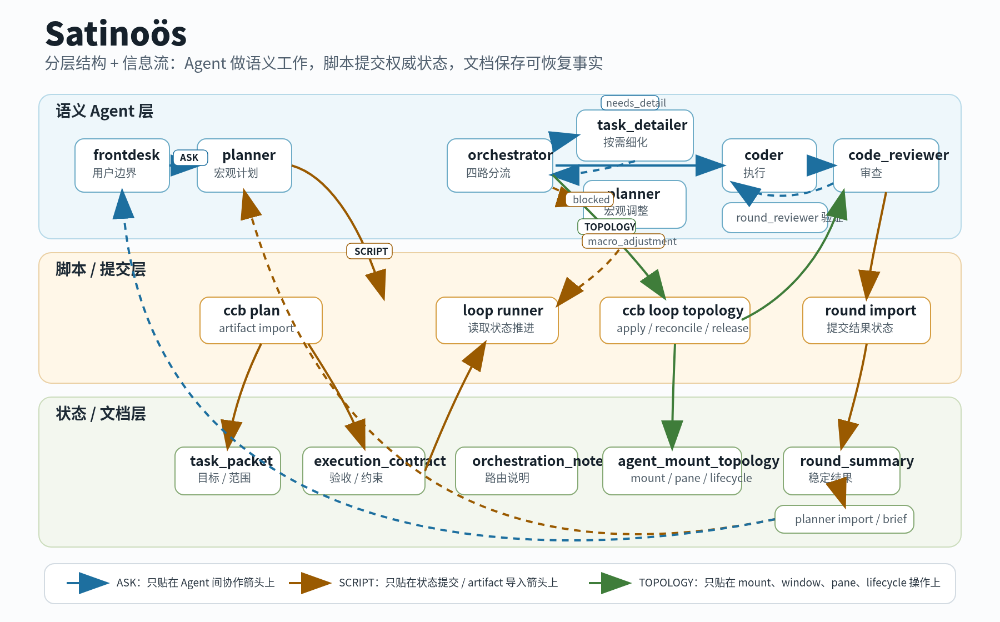

# Satinoös 工作流方案介绍

Date: 2026-07-03

Satinoös 是 CCB 上的一种脚本约束型多 Agent 工作流方案。它的目标不是让一组
Agent 自由接管项目，而是把长期任务推进拆成三个稳定部分：Agent 负责理解和
表达，脚本负责校验和提交，文档与运行时文件负责保存可恢复状态。



## 1. Satinoös 是什么

Satinoös 面向需要长期规划、分工执行和可审查结果的复杂任务。它把 CCB 从
“前台人工协调多个 Agent”推进到“由文档状态和脚本边界驱动的半自动工作流”。

这个方案保留 CCB 的可见 Agent、`ask`、运行时状态和 pane/window 管理能力，
但不把任何单个对话当作真相来源。任务是否 ready、是否完成、是否需要重规划，
都必须由脚本检查 artifact 后写入权威状态。

## 2. 核心思想

Satinoös 的核心是：

```text
稳定程序内核 + 语义 Agent + 文档状态
```

- 程序内核不追求智能，只负责锁、校验、索引、状态边、artifact 导入和动态
  Agent 挂载/释放。
- Agent 不直接拥有权威状态，只负责理解用户目标、规划任务、执行工作、审查
  结果，并产出可导入的语义 artifact。
- 文档状态保存长期事实，运行时文件保存短期事实。低频结论进入 plan-tree，
  高频执行细节留在 `.ccb/runtime` 和 artifact 记录中。

这种分工让系统既能利用 Agent 的语义能力，又不会把任务进度、验收结论或运行时
布局绑定到某段易漂移的对话记忆上。

## 3. 分层架构

Satinoös 分成三层。

| 层 | 负责什么 | 不负责什么 |
| :--- | :--- | :--- |
| 语义 Agent 层 | intake、规划、细化、执行、审查、总结 | 直接写状态、改运行时、绕过验收 |
| 脚本/提交层 | 状态转换、artifact 导入、topology apply/release、锁和校验 | 产品判断、实现策略、语义取舍 |
| 状态/文档层 | 任务包、执行合同、拓扑状态、轮次总结、plan brief | 原始聊天流水、高频日志、临时重试过程 |

三层之间有明确的控制边界：

- `ask` 只负责 Agent 间协作。
- `scripts` 只负责权威状态提交。
- `topology` 只负责 mount、window、pane、lifecycle，不描述通信流程。

## 4. 一次任务如何流动

一次任务从用户目标开始，但不会直接进入 worker。

1. `frontdesk` 接收目标、范围、约束和风险偏好，只做用户边界和汇报边界。
2. `planner` 把目标整理成 `task_packet`，并与 `orchestrator` 共同形成
   `execution_contract`；脚本负责提交和校验这些 artifact。
3. `orchestrator` 读取任务包和执行合同后做四路分流：
   - `direct_execution`：任务已经足够清楚，直接进入执行轮。
   - `needs_detail`：按需激活 `ccb_task_detailer`，补齐任务局部细节后再回到
     `orchestrator`。
   - `macro_adjustment_request`：发现宏观计划、范围或验收需要 planner 重新处理，
     不挂载 worker。
   - `blocked`：缺少硬依赖或用户输入，暂停并保留 blocker evidence。
4. 进入执行轮时，脚本提交并应用 mount topology，让所需 Agent 出现在正确的
   window/pane/lifecycle 状态中。
5. `worker` 与 `code_reviewer` 通过普通 `ask` 协作；topology 不记录它们每一条
   对话边。
6. `round_reviewer` 或对应脚本导入路径把稳定结果整理成 `round_summary`。
7. 脚本导入 `round_summary`，再把 compact 结论交给 `planner` 回填 brief 或下一轮
   规划；最终由 `frontdesk` 汇报用户可见结果。

这里的 `macro_adjustment_request` 和 `blocked` 都是合法终态，不是隐藏失败。
Satinoös 要求它们可见、可恢复、可审查，而不是伪装成成功。

## 5. 角色边界

| 角色 | 主要职责 | 明确不做 |
| :--- | :--- | :--- |
| `frontdesk` | 用户 intake、确认、最终汇报、不可恢复阻塞升级 | 调度 worker、改状态、维护执行细节 |
| `ccb_planner` | 宏观目标、plan brief、task packet、验收和风险摘要 | 维护详细实现正文、直接调度运行时 |
| `ccb_orchestrator` | 路由判断、任务拆分、请求 mount topology、组织 ask-first 协作 | 直接改 tmux、runtime、task status |
| `ccb_task_detailer` | 按需细化任务、做局部技术调研、产出 detail packet | 成为默认 planner、直接改 roadmap 或调度 worker |
| `coder` | 完成有边界的实现或分析工作 | 降低验收标准、隐藏失败 |
| `code_reviewer` | 审查实现、设计/确认验证证据、拒绝假成功 | 接管产品范围或把 partial 改成 done |
| `ccb_round_reviewer` | 审查整轮结果和证据，协助形成稳定 round summary | 直接修代码或直接写 task status |
| CCB scripts | artifact 导入、状态提交、topology apply/release、锁和校验 | 语义判断和产品取舍 |

`ccb_task_detailer` 是按需角色。即使它在某些运行时布局中可见或 parked，它也只在
`orchestrator` 判定 `needs_detail` 时承接任务局部细化。

## 6. 为什么能降低上下文漂移

Satinoös 不要求一个长对话记住所有事情。执行细节、ask 记录、provider 证据、
pane 状态和临时 artifact 留在运行时；只有验收后的稳定摘要、blocker、partial
结果、replan 原因和完成证据才进入长期文档。

这带来三个直接效果：

- `frontdesk` 和 `planner` 不被 worker 的临时上下文污染。
- `worker` 和 `code_reviewer` 可以在短上下文中完成高噪声工作，结束后释放。
- 后续恢复只依赖 task docs、runtime files 和 artifact digest，不依赖某个 Agent
  是否还记得上一轮对话。

## 7. Phase 6 当前验收边界

Phase 6 的目标是证明不同任务类型下的**单轮执行闭环成功**，不是证明长期生产工作流
已经完成。

它覆盖的单轮任务类型包括：

- `direct_execution`：planner 输出已经足够执行，orchestrator 跳过 detailer。
- `needs_detail`：先由 `ccb_task_detailer` 细化，再进入执行轮。
- `macro_adjustment_request`：发现宏观计划需要调整，退回 planner，不挂载 worker。
- `blocked`：缺硬依赖或用户输入，保留明确阻塞证据。
- `partial_completion`：部分范围完成，未完成步骤被记录为 partial，而不是伪装成
  done。

Phase 6 不证明多轮收敛、长期 daemon、自主连续循环、默认真实 provider 生产就绪、
复杂 fanout 图或通用 DAG 调度。它证明的是：在脚本权威、mount-only topology 和
ask-first 协作边界下，一个 bounded round 可以被可靠地启动、执行、总结和清理。

## 8. 后续能力

Satinoös 后续要补的不是更复杂的 topology DSL，而是围绕已验证的单轮闭环继续增强：

- 多轮收敛：把 `partial`、`replan_required` 和 blocker 恢复成下一轮可执行任务。
- monitor/recovery：区分确定性健康检查和语义恢复建议，避免误判 provider 或 pane
  异常。
- 真实 provider gate：在 fake-provider 稳定后，做小规模 Codex/Claude opt-in smoke。
- 文档治理：控制 plan-tree 噪声，保留摘要、证据和决策，归档高频过程。
- 可观测性：让用户和维护者能看懂当前 owner、阻塞点、artifact 证据和动态 Agent
  生命周期。

Satinoös 的长期价值不在于让 Agent 数量变多，而在于让每个 Agent 的语义贡献都能
经过脚本边界进入可恢复、可审查、可继续推进的状态系统。
